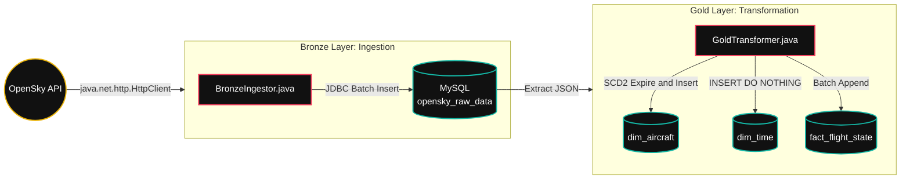
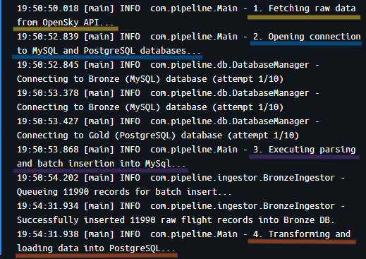
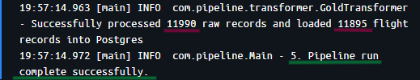
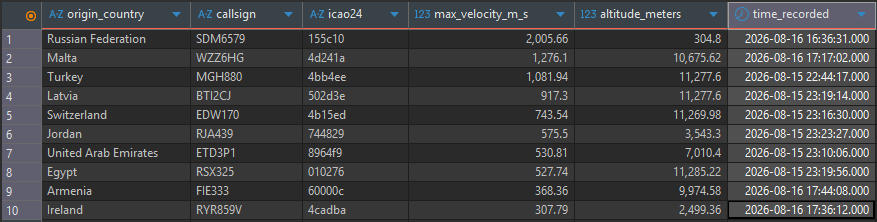

# Aviation ETL Pipeline


## Overview

An Extract, Transform, and Load (ETL) data pipeline that pulls live flight data from the OpenSky API, lands it in MySQL, and transforms it into a star schema in PostgreSQL. Core Java and raw JDBC were selected for this project to experience the mechanics of data engineering and database architecture without relying on heavy abstractions.

> **Note:** This project is backend, database, and container work only. Frontend (UI) and/or deployment are not priorities. The focus is the pipeline itself so, for now, the concentration is on optimizing that.

## Architecture Overview


```mermaid
flowchart LR
    API((OpenSky API)) -- " java.net.http.HttpClient " --> Bronze

    subgraph Bronze [Bronze Layer: Ingestion]
        direction TB
        Java1[BronzeIngestor.java] -- " JDBC Batch Insert " --> MySQL[(MySQL<br/>opensky_raw_data)]
    end

    MySQL -- " Extract JSON " --> Gold

    subgraph Gold [Gold Layer: Transformation]
        direction TB
        Java2[GoldTransformer.java]

        Java2 -- " SCD2 Expire and Insert " --> dim_aircraft[(dim_aircraft)]
        Java2 -- " INSERT DO NOTHING " --> dim_time[(dim_time)]
        Java2 -- " Batch Append " --> fact_flight_state[(fact_flight_state)]
    end

%% Styling
    classDef javaApp fill:#111111,stroke:#f43f5e,stroke-width:2px,color:#ffffff;
    classDef database fill:#111111,stroke:#14b8a6,stroke-width:2px,color:#ffffff;
    classDef api fill:#111111,stroke:#eab308,stroke-width:2px,color:#ffffff;

    class Java1 javaApp;
    class Java2 javaApp;
    class MySQL database;
    class dim_aircraft database;
    class dim_time database;
    class fact_flight_state database;
    class API api;
```

---

## How It Works

**Bronze (MySQL):** Each flight state from the OpenSky response is inserted as-is into a single JSON column. No parsing happens at this stage, so a malformed or unexpected field in the API response doesn't stop ingestion. Validation and parsing happen later, in the transform step.

**Gold (PostgreSQL):** `GoldTransformer` reads unprocessed rows out of the Bronze table, resolves each flight to an aircraft dimension key and a time dimension key, and inserts the result into `fact_flight_state`. The whole run is wrapped in a single transaction across both databases, so a failure partway through rolls back instead of leaving Bronze and Gold out of sync with each other.

---

**Bronze Layer: Raw MySQL Landing Zone**
*Here, the OpenSky JSON array is staged in the single raw_data column.*

[](images/raw_data_db.png)

**Gold Layer: PostgreSQL Fact Table**
*The central fact table containing isolated telemetry metrics and foreign keys.*

[](images/flight_tab.png)

**Gold Layer: PostgreSQL Dimension Tables**
*The surrounding dimensions containing descriptive aircraft attributes and standardized time intervals.*

<p align="center">
    <a href="images/aircraft_tab.png">
      
    </a>
    &nbsp;&nbsp;&nbsp;&nbsp;&nbsp;&nbsp;&nbsp;&nbsp;&nbsp;&nbsp;
    <a href="images/time_tab.png">
      
    </a>
</p>

**Pipeline Run**
*Cropped console output from a full run, showing each stage of the ETL process completing.*

[](images/docker_log1.png)
[](images/docker_log2.png)

---

## Design Decisions

- **Framework-free HTTP client.** `OpenSkyClient` uses `java.net.http.HttpClient` directly instead of a REST client library. This was a deliberate choice to handle timeouts, response parsing, and thread interruption manually instead of letting a framework handle them out of sight.
- **Raw JSON in Bronze.** Storing the payload as one JSON column instead of parsed fields means a change in OpenSky's response shape won't break ingestion outright, it'll surface later during transformation instead.
- **SCD Type 2 on `dim_aircraft` only.** When an aircraft's callsign or origin country changes, the old row is expired (`is_current = FALSE`, `effective_to = NOW()`) and a new one is inserted, instead of overwriting the existing row. `dim_time` doesn't need this, timestamps don't change once written, so it's insert-once.
- **In-memory caching within a run.** Aircraft and time lookups are cached in a `HashMap` so the same aircraft or timestamp isn't queried twice during a single run. The cache is not persisted between runs, it starts empty each time `Main` executes.
- **Connection retry on startup.** `DatabaseManager` retries failed connections with a delay, since the Docker database containers can still be starting up when the app tries to connect.

---

## Querying the Gold Layer

With the data loaded into a star schema, questions like "top 10 fastest recorded aircraft" can be answered with a straightforward window function instead of application code:

[](images/sql_query.png)

Query Output (Top 10 Fastest Aircraft):

[](images/avi-pipe-sql-result.png)

> **Note:** The top 3 speeds in example above aren't physically possible for an aircraft. OpenSky is a crowdsourced network of volunteer-run ADS-B receivers, so occasional bad readings are expected. This pipeline doesn't filter them out yet (see Issue #13).

---

## Known Limitations

- No automated tests yet. Verification is currently manual, through DBeaver, against both databases (see Issue #14).
- No validation on incoming velocity/altitude values yet. OpenSky's data comes from volunteer-run receivers, so occasional bad readings (see the query results above) currently pass through to the Gold layer as-is (see Issue #13).
- `ConfigManager` has a planned `validateRequiredKeys` check that isn't implemented yet, so a missing config value currently fails at first use rather than at startup (see Issue #12).

---

## Tech Stack


* **Language:** Java 21 (Core)
* **API Client:** Native `java.net.http.HttpClient` connecting to the OpenSky REST API
* **Data Access:** JDBC (no ORM)
* **Databases:** MySQL (Bronze Layer, raw landing zone), PostgreSQL (Gold Layer, star schema)
* **Database Management Tool:** DBeaver
* **Infrastructure:** Docker & Docker Compose
* **Build Tool:** Maven

---

## Data Attribution

Flight data comes from the [OpenSky Network](https://opensky-network.org). Per their terms of use, any publication using this data should cite:

```
Matthias Schäfer, Martin Strohmeier, Vincent Lenders, Ivan Martinovic and Matthias Wilhelm.
"Bringing Up OpenSky: A Large-scale ADS-B Sensor Network for Research".
In Proceedings of the 13th IEEE/ACM International Symposium on Information Processing in Sensor Networks (IPSN), pages 83-94, April 2014.
```

---

## Getting Started

### Prerequisites

- Docker & Docker Compose
- Java 17 or higher (built and tested on 21)
- Maven

Development was done in IntelliJ IDEA with DBeaver for inspecting the databases, but neither is required. Any IDE and any SQL client work fine.

---

### Setup

1. **Clone the repo.**
```bash
   git clone https://github.com/sflugum/aviation-pipeline.git
   cd aviation-pipeline
```

2. **Environment variables.** Copy `.env.example` to `.env` and fill in database credentials and the OpenSky API URL. `ConfigManager` checks OS environment variables first, then `.env`, then `application.properties`.

3. **Build and run.**
```bash
   docker compose up -d --build
```
This starts all three containers, the two databases and the pipeline itself, and the pipeline runs to completion automatically. `--build` is only needed the first time or after code changes; later runs can drop it if nothing in the build context changed.

4. **Confirm the schema.** The database containers are ready within seconds, well before the pipeline finishes. At this point you can connect to `localhost:3306` (MySQL/Bronze) and `localhost:5433` (PostgreSQL/Gold) with any SQL client (DBeaver, `psql`/`mysql` CLI, etc.) and confirm the tables exist: `opensky_raw_data` on the MySQL side, and `dim_aircraft`, `dim_time`, and `fact_flight_state` on the PostgreSQL side. They'll be empty at this point, that's expected, the pipeline hasn't finished running yet.

5. **Check the run.** The pipeline container (`aviation-data-pipe`) exits once the run finishes, so its startup logs alone won't show the full run, which takes a few minutes. To see the complete sequence, either watch Docker Desktop's log view for that container, or run:
```bash
   docker compose logs -f aviation-data-pipe
```
A successful run ends with a "Pipeline run complete successfully" line.

6. **Verify the data.** Back in your SQL client, confirm rows actually landed in the tables from step 4.