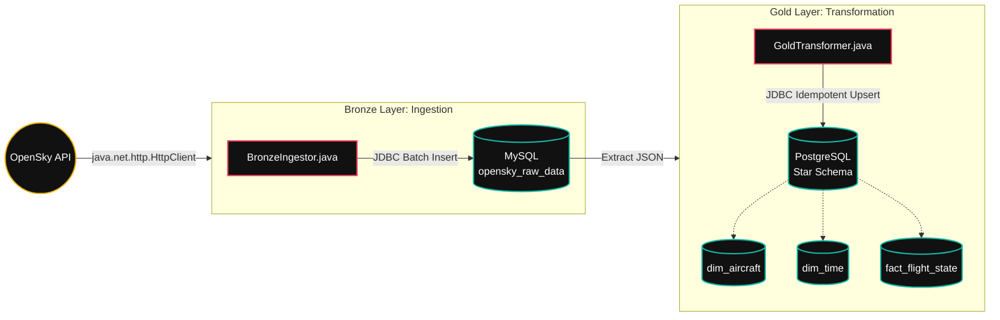
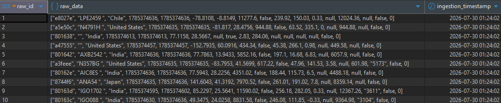
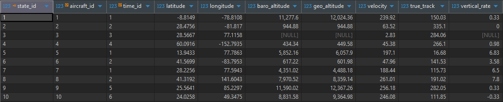
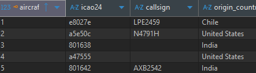
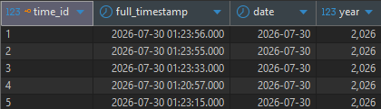
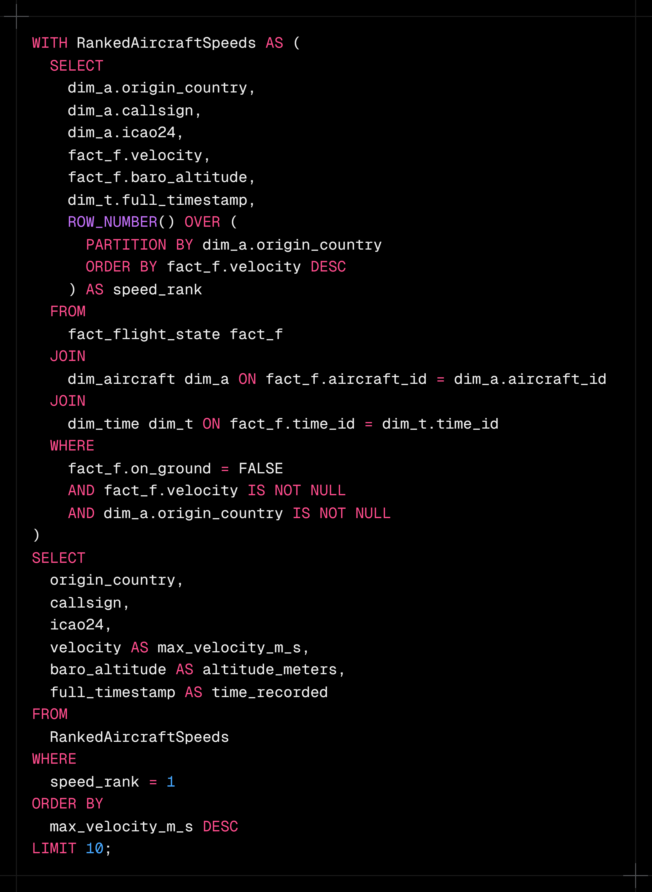
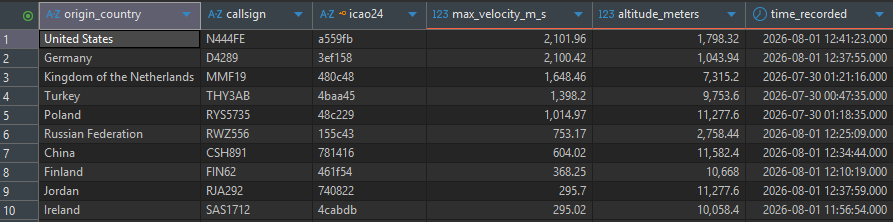
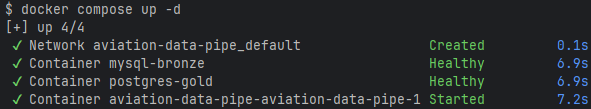

# Aviation ETL Pipeline


## Overview

An Extract, Transform, and Load (ETL) data pipeline built from the ground up to process aviation data. I chose to use
core Java and raw JDBC for this project to develop a deep, mechanical understanding of data engineering and database
architecture without relying on heavy abstractions.

## Architecture Overview


```mermaid
flowchart LR
    API((OpenSky API)) -- " java.net.http.HttpClient " --> Bronze

    subgraph Bronze [Bronze Layer: Ingestion]
        direction TB
        Java1[BronzeIngestor.java] -- " JDBC Batch Insert " --> MySQL[(MySQL<br/>opensky_raw_data)]
    end

    MySQL -- " Extract JSON " --> Gold

    subgraph Gold [Gold Layer: Transformation]
        direction TB
        Java2[GoldTransformer.java] -- " JDBC Idempotent Upsert " --> Postgres[(PostgreSQL<br/>Star Schema)]
    
    %% Database internal structure
      Postgres -.-> dim_aircraft[(dim_aircraft)]
      Postgres -.-> dim_time[(dim_time)]
      Postgres -.-> fact_flight_state[(fact_flight_state)]
    end

%% Styling
  classDef javaApp fill:#111111,stroke:#f43f5e,stroke-width:2px,color:#ffffff;
  classDef database fill:#111111,stroke:#14b8a6,stroke-width:2px,color:#ffffff;
  classDef api fill:#111111,stroke:#eab308,stroke-width:2px,color:#ffffff;

  class Java1 javaApp;
  class Java2 javaApp;
  class MySQL database;
  class Postgres database;
  class dim_aircraft database;
  class dim_time database;
  class fact_flight_state database;
  class API api;
```

---

## High-Performance Data Engineering

### 1. Framework-Free API Extraction

To build a mechanical understanding of network I/O, the pipeline intentionally bypasses external REST frameworks (like
Spring WebClient) in favor of Java's native `java.net.http.HttpClient`. It handles connection timeouts, synchronous JSON
extraction, and concurrency thread interruptions purely through core Java mechanics before handing the payload to the
Bronze layer.

### 2. Data Transformation: Bronze to Gold Layer

Raw JSON telemetry is extracted from the MySQL Bronze layer, strictly typed, standardized, and loaded into the
PostgreSQL Gold layer using a relational Star Schema.

**Bronze Layer: Raw MySQL Landing Zone**
*Here, the OpenSky JSON array is staged in the single raw_data column.*

[](images/raw_data_db.png)

**Gold Layer: PostgreSQL Fact Table**
*The central fact table containing isolated telemetry metrics and foreign keys.*

[](images/flight_tab.png)

**Gold Layer: PostgreSQL Dimension Tables**
*The surrounding dimensions containing descriptive aircraft attributes and standardized time intervals.*

<p align="center">
    <a href="images/aircraft_tab.png">
      
    </a>
    <a href="images/time_tab.png">
      
    </a>
</p>

### 3. Idempotent Dimension Loading (SCD Type 1)

To ensure the ETL pipeline remains highly performant and idempotent, the Gold layer transformation utilizes native
PostgreSQL UPSERTs combined with the RETURNING clause.

[](images/sql_query.png)

Mechanical Advantages:

- Zero ORM Overhead: Built using raw JDBC PreparedStatement to maintain absolute control over memory and execution
  plans.
- Reduced Network I/O: The RETURNING clause eliminates the N+1 query problem by retrieving the database-generated
  surrogate key (aircraft_id) instantly, which is then loaded into an in-memory Java HashMap cache to prevent future
  database hits during the batch process.

### 4. Star Schema Analytics: Querying the Gold Layer

With the data successfully normalized into a Star Schema, we can execute complex business-intelligence queries, such as
ranking the fastest recorded aircraft per country.

Query Output (Top 10 Fastest Aircraft):

[](images/sql_query_result.png)

---

## Tech Stack


* **Language:** Java (Core)
* **API Client:** Native `java.net.http.HttpClient`
* **Data Access:** JDBC
* **Databases:** MySQL (Bronze Layer), PostgreSQL (Gold Layer)
* **Infrastructure:** Docker & Docker Compose
* **Build Tool:** Maven

## Getting Started

### Prerequisites

To run this pipeline locally, ensure you have the following installed:

- Docker & Docker Compose (for managing database containers)
- Java SDK (Version 17 or higher recommended)
- Maven (for dependency management and building the application)
- DBeaver (or your preferred database management tool to inspect schemas and data)

---

### Installation & Setup

#### 1. Environment Configuration

Before spinning up the infrastructure, configure your local environment variables to manage database credentials and API
connectivity securely.

* Create a `.env` file in the project root directory (you can use `.env.example` as a template).
* Populate the `.env` file with your specific database root passwords, usernames, ports, and OpenSky API credentials.
* The application is configured to automatically fall back through `System.getenv()`, `.env`, and
  `application.properties` to securely load these credentials into the JDBC connections.

#### 2. Database Infrastructure

The pipeline uses local Docker containers to isolate the raw data landing zone (MySQL) from the eventual cleaned data
warehouse zone (PostgreSQL).

The schema creation for both databases is handled automatically on startup. The `docker-compose.yaml` is configured to
mount local SQL initialization scripts directly into the containers' entrypoints.

To build the images, execute the schema initialization, and launch both database containers in detached mode, navigate
to the project root and run:

```bash
docker compose up -d --build

```

> **Note:** The first run (or after code changes) requires `--build` to rebuild images. Subsequent runs can often use `docker compose up -d` if no build context has changed, as shown in the screenshot below.

[](images/docker_start.png)

#### 3. Database Verification (DBeaver)

Before executing the application code, open **DBeaver** to verify that your local network interfaces to the containers
are fully active and the initialization scripts ran successfully:

* **MySQL (Bronze Layer):** Connect via localhost:3306. Verify that the connection is active and that your initial
  landing table (opensky_raw_data) has been successfully created.
* **PostgreSQL (Gold Layer):** Connect via localhost:5432. Verify that the target data warehouse container is live and
  that the dim_aircraft, dim_time, and fact_flight_state tables exist.

#### 4. Running the Application

The pipeline now executes the full Extract, Transform, and Load (ETL) lifecycle. It pulls live tracking data from the
OpenSky Network API, stages it in the raw MySQL database, processes the data in-memory, and loads it into the PostgreSQL
Star Schema.

1. Open the project root folder within your preferred IDE.
2. Allow Maven to import and synchronize all project dependencies.
3. Navigate to the main entry point file: `src/main/java/com/pipeline/Main.java`.
4. Run Main.java directly through the IDE to execute the full pipeline flow. Check your IDE's console output for logging
   steps.


