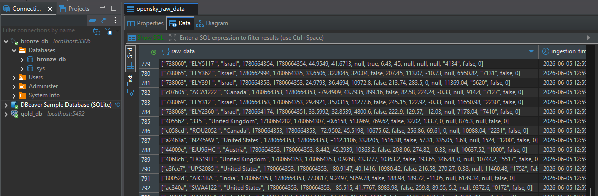

# Aviation ETL Pipeline


## Overview
An Extract, Transform, and Load (ETL) data pipeline built from the ground up to process aviation data. I chose to use core Java and raw JDBC for this project to develop a deep, mechanical understanding of data engineering and database architecture without relying on heavy abstractions.

## Current Status
🚧 **Phase 1: Database Foundation (Completed)**
* The initial database schema and SQL scripts have been drafted and are available in the repository.

🔜 **Phase 2: Containerization (Completed)**
* Setting up the Docker environment to containerize the database and ensure consistent, isolated development workflows.

⚙️ **Phase 3: Extraction and Ingestion (Completed)**
* Building a core Java/Maven application that utilizes native `HttpClient` for aviation REST API retrieval and raw JDBC for MySQL ingestion, intentionally bypassing high-level frameworks to build mechanical mastery of database connection management.

🔄 **Phase 4: Transformation and Loading (Completed)**
* Built a Java service to query raw MySQL data, process the ResultSet through in-memory logic (handling nulls, converting unix timestamps, and filtering incomplete records), and load the clean data into a PostgreSQL Star Schema. Implemented production-grade idempotency (`ON CONFLICT`) and in-memory dimension caching to safely update existing records and prevent duplication over repeated runs.

🧪 **Phase 5: Testing and Automation (In Progress)**
* Implementing JUnit tests mocking API edge cases (e.g., corrupted JSON, null values) and establishing a GitHub Actions CI/CD workflow for automated builds.

---

## Extraction in Action



---

## Tech Stack


* **Language:** Java (Core)
* **Data Access:** JDBC
* **Databases:** MySQL (Bronze Layer), PostgreSQL (Gold Layer)
* **Infrastructure:** Docker & Docker Compose
* **Build Tool:** Maven

## Project Roadmap
- [x] **Step 1:** Database Foundation: Draft SQL scripts and establish initial data models.
- [x] **Step 2:** Containerization: Configure Docker and `docker-compose.yml` for local database hosting.
- [x] **Step 3:** Extraction and Ingestion: Build Java HttpClient retrieval and use raw JDBC to load OpenSky data into MySQL.
- [x] **Step 4:** Transformation and Loading: Query raw MySQL data, apply in-memory business logic (null handling, timestamp conversion, filtering), and load clean data to PostgreSQL with production-grade idempotency.
- [ ] **Step 5:** Testing and Automation: Implement JUnit tests mocking API edge cases (e.g., corrupted JSON, null values) and establish a GitHub Actions CI/CD workflow for automated builds.

## Getting Started

### Prerequisites
To run this pipeline locally, ensure you have the following installed:
- Docker & Docker Compose (for managing database containers)
- Java SDK (Version 17 or higher recommended)
- Maven (for dependency management and building the application)
- DBeaver (or your preferred database management tool to inspect schemas and data)

---

### Installation & Setup

#### 1. Environment Configuration

Before spinning up the infrastructure, configure your local environment variables to manage database credentials and API connectivity securely.

* Create a `.env` file in the project root directory (you can use `.env.example` as a template).
* Populate the `.env` file with your specific database root passwords, usernames, ports, and OpenSky API credentials.
* The application is configured to automatically fall back through `System.getenv()`, `.env`, and `application.properties` to securely load these credentials into the JDBC connections.

#### 2. Database Infrastructure

The pipeline uses local Docker containers to isolate the raw data landing zone (MySQL) from the eventual cleaned data warehouse zone (PostgreSQL).

The schema creation for both databases is handled automatically on startup. The `docker-compose.yaml` is configured to mount local SQL initialization scripts directly into the containers' entrypoints, ensuring the raw data tables and structured Star Schema are built exactly as needed before the Java application connects.

To build the images, execute the schema initialization, and launch both database containers in detached mode, navigate to the project root and run:

```bash
docker compose up -d --build

```

#### 3. Database Verification (DBeaver)

Before executing the application code, open **DBeaver** to verify that your local network interfaces to the containers are fully active and the initialization scripts ran successfully:

* **MySQL (Bronze Layer):** Connect via localhost:3306. Verify that the connection is active and that your initial landing table (opensky_raw_data) has been successfully created by the mounted Docker scripts.
* **PostgreSQL (Gold Layer):** Connect via localhost:5432. Verify that the target data warehouse container is live and that the dim_aircraft, dim_time, and fact_flight_state tables exist.

#### 4. Running the Application

The pipeline now executes the full Extract, Transform, and Load (ETL) lifecycle. It pulls live tracking data from the OpenSky Network API, stages it in the raw MySQL database, processes the data in-memory, and loads it into the PostgreSQL Star Schema.

1. Open the project root folder within your preferred IDE.
2. Allow Maven to import and synchronize all project dependencies.
3. Navigate to the main entry point file: `src/main/java/[your-package-path]/Main.java`.
4. Run Main.java directly through the IDE to execute the full pipeline flow. Check your IDE's console output for logging steps.


